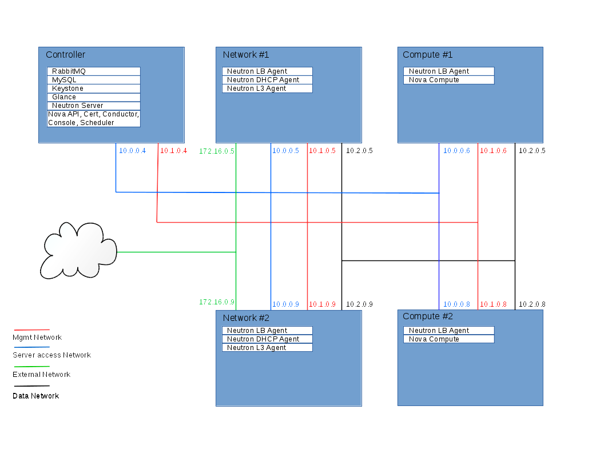
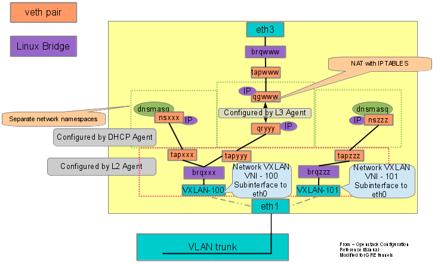
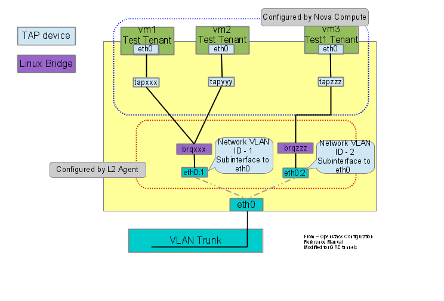
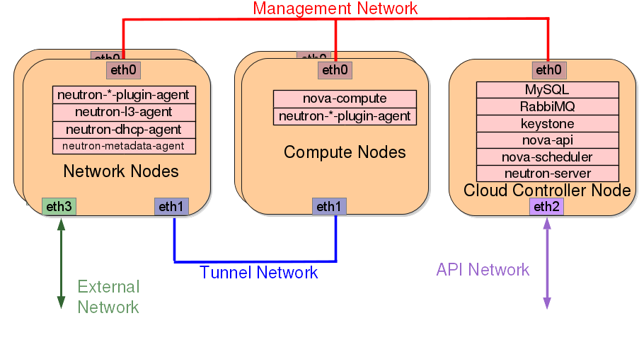

# Scenario: Basic implementation of HA routers

This scenario describes a basic implementation of the OpenStack
Networking Highly Available (HA) feature using the ML2
plug-in with Linux bridge. The example configuration creates
one flat external network and VXLAN tenant networks. However, HA
also supports VLAN external networks and GRE tenant networks with
minor modifications to the example configuration.

## Requirements

1. One controller node with one network interface: management.

1. At least two network nodes with three network interfaces: management, instance
   tunnels, and external (typically the Internet). The Linux bridge
   bridge `br-ex` must contain a port on the external interface.

1. At least two compute nodes with two network interfaces: management
   and instance tunnels.




**Warning: Linux bridge HA routers are currently broken when using
L2Population. This means that Linux bridge and VXLAN does not work.

bug - ????

**For best operation, consider using the *master* branch of neutron:**

http://git.openstack.org/cgit/openstack/neutron/

## Prerequisites

1. Controller node

  1. Operational SQL server with `neutron` database and appropriate
     configuration in the neutron-server.conf file.

  1. Operational message queue service with appropriate configuration
     in the neutron-server.conf file.

  1. Operational OpenStack Identity service with appropriate configuration
     in the neutron-server.conf file.

  1. Operational OpenStack Compute controller/management service with
     appropriate configuration to use neutron in the nova.conf file.

  1. Neutron server service, ML2 plug-in, and any dependencies.

1. Network node

  1. Operational OpenStack Identity service with appropriate configuration
     in the neutron-server.conf file.

  1. ML2 plug-in, Linux bridge agent, L3 agent,
     DHCP agent, metadata agent, and any dependencies including the
     `ipset` and `conntrack` utilities.

1. Compute nodes

  1. Operational OpenStack Identity service with appropriate configuration
     in the neutron-server.conf file.

  1. Operational OpenStack Compute controller/management service with
     appropriate configuration to use neutron in the nova.conf file.

  1. ML2 plug-in, Linux bridgeh agent and any dependencies including the `ipset` and
     `conntrack` utilities.


## Architecture

### General

The general HA architecture augments the legacy architecture by
creating additional 'qrouter' namespaces for each router created.
An "HA" network is created and connecting between each qrouter namespace.
A keepalived process is created within each namepspace to manage
which namespace router will be the master and applies the gateway IP
as a VIP into the master namespace. If a failure is detected a new
master is elected and the VIPs are moved into the new master namespace.


The network node runs the L3 agent, DHCP agent, and metadata agent. HA 
routers can coexist with multiple DHCP agents. DHCP agents can even run
on compute nodes. In addition to `qrouter` namespaces, the L3 agent 
manages SNAT for any instances without a floating IP address and well as
floating IPs within the namespace. The metadata agent handles metadata
operations for instances using tenant networks on HA routers.



The compute node runs the L2 Linux bridge agent. Using a separate Linux 
bridge for each network, virtual ethernet pairs connect the VM to the
bridge for a network. A tunnel or VLAN interface is also connected to the
bridge to connect to the data network interface.



### Components

The network node contains the following components:

1. Linux bridge agent managing Linux bridges, connectivity among
   them, and interaction with other network components
   such as namespaces  and underlying interfaces.

1. DHCP agent managing the `qdhcp` namespaces.

  1. The `dhcp` namespaces provide DHCP services for instances using 
     tenant networks on HA routers.

1. L3 agent managing the `qrouter` namespaces.

  1. For instances using tenant networks using HA routers, the
     `qrouter` namespaces perform SNAT between tenant and external
     networks. They also route metadata traffic between instances using
     tenant networks on HA routers and the metadata agent.


1. Metadata agent handling metadata operations.

  1. The metadata agent handles metadata operations for instances
     using tenant networks using HA routers.


The compute nodes contain the following components:

1. Linux bridge agent managing Linux bridges, connectivity among
   them, and interaction via virtual ethernet pairs with other network 
   components such as namespaces, Linux bridges, and underlying interfaces.

1. L3 agent managing the `qrouter` namespace.

  1. For instances using tenant networks on HA routers, the
     `qrouter` namespaces route network traffic among tenant
     networks.

  1. For instances using tenant networks on HA routers, the
     qrouter namespaces perform DNAT and SNAT between tenant and external
     networks.

1. Metadata agent handling metadata operations.

  1. The metadata agent handles metadata operations for instances
     using tenant networks on distributed routers.

1. Linux bridges handling security groups.

  1. The Networking service uses iptables to manage security groups for
     instances.


System environment:



## Configuration:

The configuration files on each node, controller, network, compute, are similar with only the local_ip set to the interface on the data network. The crutial settings are indicated as follows:

1. Configure the base options

   1. Edit the /etc/neutron/neutron.conf file:

    ```
    router_distributed = False
    l3_ha = True
    max_l3_agents_per_router = 3
    min_l3_agents_per_router = 2
    l3_ha_net_cidr = 169.254.192.0/18
    ```

   2. Edit the l3_agent.ini file:
 
    ```
    agent_mode = legacy
    ```

 
1. Configure the ML2 plug-in.

   1. Edit the /etc/neutron/plugins/ml2/ml2_conf.ini file:
 
    ```
    [linuxbridge]

    [l2pop]
    agent_boot_time = 180

    [vxlan]
    enable_vxlan = True
    local_ip = TUNNEL_NETWORK_INTERFACE_IP
    l2_population = True
    ```
 
 
  Note: Replace NOVA_ADMIN_USERNAME, NOVA_ADMIN_TENANT_ID, and
  NOVA_ADMIN_PASSWORD with suitable values for your environment.


1. Start the following services
   1. Controller node:
      * Server
   2. Network node(s):
      * Linux bridge agent
      * L3 agent
      * DHCP agent
      * Metadata agent
   3. Computer node(s):
      * Linux bridge agent

##Create the routers and gateway:

    ```
    neutron net-create private
    neutron subnet-create --name private-subnet private 10.1.0.0/28
    neutron net-create private1
    neutron subnet-create --name private1-subnet private1 10.2.0.0/28
    neutron net-create --shared public --router:external=True
    neutron net-create --shared public --router:external=True --provider:network_type flat --provider:physical_network phy-br-ex
    neutron subnet-create --name public-subnet public  --allocation-pool start=172.16.0.32,end=172.16.0.64 --gateway=172.16.0.5 --enable_dhcp=False 172.16.0.0/24
    neutron router-create MyRouter --distributed False --ha True
    neutron router-interface-add MyRouter private-subnet
    neutron router-interface-add MyRouter private1-subnet
    neutron router-gateway-set MyRouter public
    ```

##Boot two VMs, one on each network:

    ```
    nova boot --image cirros-qcow --flavor 1 --nic net-id=<UUID of private network> One
    nova boot --image cirros-qcow --flavor 1 --nic net-id=<UUID of private1 network> Two
    ```
#Packet Flow through HA router environment 

The network implementation in this example uses Linux Bridge as the ML2 agent.   VXLAN tunnels are used, VLANs could also be used but with Linux Bridge GRE tunnelsare not a possibility. Linux Bridges are simpler to implement and understand. Performance wise when using tunneling technologies chose a NIC card which has a driver that supports off-loading the tunneling to the NIC card from the host CPU. Using the host CPU to impliment the tunneling, either using Open vSwitch or the Linux tunnel driver can reduce the network throughput by up to 3 to 4X.

veth pairs are used extensively in neutron as the “wiring' to connect the various networking pieces together. Typically in this setup on the network node one end of a veth pair will be in a network namespace and the other end will be connected to a bridge. The end within a namespace will have a meaning full beginning such as qg (for the gateway connection) or qr (router connection to the network) inside the qrouter interface. On the compute node tap interfaces connect to the VM an to a Linux Bridge. In this set up one or more VMs will connect to the bridge with a VXLAN tunnel connection. Each VXLAN tunnel connection represents a separate network and has a unique tunnel id (vni).

Linux Bridge names take the form of a prefix of brq followed by the first 10 characters of the network id (includes the -). The tap interfaces in the bridges are one half of an virtual ethernet pair of the form tap followed by the first 11 characters of the port id (includes the -). The other end of the veth pair will be inside one of the network namespaces. The UUID part of the tap interface will be used as the last part of interface within a namespace.

The following namespaces are created on the network node:
qdhcp-<network id>: dhcp namespace - one is created for each tenant network on compute nodes the have a VM connected to the network. There is a dnsmasq process running within the namespace to hand out IPs to VMs on a network. With in this namespace interfaces using ns-<port id first 10 char> with the other end of the veth pair connected to the bridge containing a connection to the router and a VXLAN interface with tunnel id assigned to the network. There is a dnsmasq process running within the namespace to hand out IPs to VMs on a network.

qrouter-<router id>: router namespace - each tenant can create routes, HA routers are created for tenants on network nodes.  at least min_l3_agents_per_router routers are created on various network node (only one per network node) and no more than max_l3_agents_per_router routers are created. A keepalived process runs within the namespace and communicates with the other keepalived processes for this tenant 's HA routers.

Three different types of interfaces can be found within the qrouter namespace. One named ha-<port id 10 chars> that connects to a bridge having a VXLAN interface tunnel id of the HA network for vrrp communication between routers. A qg-<port id 10 chars> interface which connects to a br-ex bridge and to the outside network. A qr-<port id 10 chars> which connects to the bridge containing the connection to the DHCP namespace and the VXLAN tunnel for the network.

The bridges created on the network node take the form of brq<network id 10 chars>

There are no namespaces created on the compute nodes but there is a bridge for each network that connects to a VM residing on the compute node. 

Namespaces on network nodes:
active network node:

```
root@network neutron#ip netns exec qrouter-5e9b2a5f-4431-48a0-ad31-a46c987506cf ip a
1: lo: <LOOPBACK,UP,LOWER_UP> mtu 65536 qdisc noqueue state UNKNOWN group default 
    link/loopback 00:00:00:00:00:00 brd 00:00:00:00:00:00
    inet 127.0.0.1/8 scope host lo
       valid_lft forever preferred_lft forever
    inet6 ::1/128 scope host 
       valid_lft forever preferred_lft forever
2: ha-9c3955a7-32: <BROADCAST,MULTICAST,UP,LOWER_UP> mtu 1500 qdisc pfifo_fast state UP group default qlen 1000
    link/ether fa:16:3e:10:4d:61 brd ff:ff:ff:ff:ff:ff
    inet 169.254.192.12/18 brd 169.254.255.255 scope global ha-9c3955a7-32
       valid_lft forever preferred_lft forever
    inet6 fe80::f816:3eff:fe10:4d61/64 scope link 
       valid_lft forever preferred_lft forever
3: qr-88c5895b-17: <BROADCAST,MULTICAST,UP,LOWER_UP> mtu 1500 qdisc pfifo_fast state UP group default qlen 1000
    link/ether fa:16:3e:6d:54:62 brd ff:ff:ff:ff:ff:ff
    inet 10.2.0.1/28 scope global qr-88c5895b-17
       valid_lft forever preferred_lft forever
    inet6 fe80::f816:3eff:fe6d:5462/64 scope link 
       valid_lft forever preferred_lft forever
4: qr-b4a07ce5-34: <BROADCAST,MULTICAST,UP,LOWER_UP> mtu 1500 qdisc pfifo_fast state UP group default qlen 1000
    link/ether fa:16:3e:ae:b8:65 brd ff:ff:ff:ff:ff:ff
    inet 10.1.0.1/28 scope global qr-b4a07ce5-34
       valid_lft forever preferred_lft forever
    inet6 fe80::f816:3eff:feae:b865/64 scope link 
       valid_lft forever preferred_lft forever
5: qg-f454eff8-ea: <BROADCAST,MULTICAST,UP,LOWER_UP> mtu 1500 qdisc pfifo_fast state UP group default qlen 1000
    link/ether fa:16:3e:37:3e:a9 brd ff:ff:ff:ff:ff:ff
    inet 172.16.0.32/24 scope global qg-f454eff8-ea
       valid_lft forever preferred_lft forever
    inet6 fe80::f816:3eff:fe37:3ea9/64 scope link 
       valid_lft forever preferred_lft forever
```

```
root@network:neutron# ip netns exec qdhcp-31d70a48-007b-43e2-ae15-58e462c2a2d4 ip a
1: lo: <LOOPBACK,UP,LOWER_UP> mtu 65536 qdisc noqueue state UNKNOWN group default 
    link/loopback 00:00:00:00:00:00 brd 00:00:00:00:00:00
    inet 127.0.0.1/8 scope host lo
       valid_lft forever preferred_lft forever
    inet6 ::1/128 scope host 
       valid_lft forever preferred_lft forever
2: ns-c45d79b0-8a: <BROADCAST,MULTICAST,UP,LOWER_UP> mtu 1500 qdisc pfifo_fast state UP group default qlen 1000
    link/ether fa:16:3e:8a:5f:a5 brd ff:ff:ff:ff:ff:ff
    inet 10.2.0.5/28 brd 10.2.0.15 scope global ns-c45d79b0-8a
       valid_lft forever preferred_lft forever
    inet6 fe80::f816:3eff:fe8a:5fa5/64 scope link 
       valid_lft forever preferred_lft forever
```

```

root@network:neutron#ip netns exec qdhcp-12403865-de58-4cd2-9b8a-54242813387a ip a
1: lo: <LOOPBACK,UP,LOWER_UP> mtu 65536 qdisc noqueue state UNKNOWN group default 
    link/loopback 00:00:00:00:00:00 brd 00:00:00:00:00:00
    inet 127.0.0.1/8 scope host lo
       valid_lft forever preferred_lft forever
    inet6 ::1/128 scope host 
       valid_lft forever preferred_lft forever
2: ns-22e35cc9-7c: <BROADCAST,MULTICAST,UP,LOWER_UP> mtu 1500 qdisc pfifo_fast state UP group default qlen 1000
    link/ether fa:16:3e:c8:45:3e brd ff:ff:ff:ff:ff:ff
    inet 10.1.0.5/28 brd 10.1.0.15 scope global ns-22e35cc9-7c
       valid_lft forever preferred_lft forever
    inet6 fe80::f816:3eff:fec8:453e/64 scope link 
       valid_lft forever preferred_lft forever
```

passive network node:

```
root@network2:~# ip netns exec qrouter-5e9b2a5f-4431-48a0-ad31-a46c987506cf ip a
1: lo: <LOOPBACK,UP,LOWER_UP> mtu 65536 qdisc noqueue state UNKNOWN group default 
    link/loopback 00:00:00:00:00:00 brd 00:00:00:00:00:00
    inet 127.0.0.1/8 scope host lo
       valid_lft forever preferred_lft forever
    inet6 ::1/128 scope host 
       valid_lft forever preferred_lft forever
2: ha-cea5241d-c6: <BROADCAST,MULTICAST,UP,LOWER_UP> mtu 1500 qdisc pfifo_fast state UP group default qlen 1000
    link/ether fa:16:3e:2e:f3:64 brd ff:ff:ff:ff:ff:ff
    inet 169.254.192.11/18 brd 169.254.255.255 scope global ha-cea5241d-c6
       valid_lft forever preferred_lft forever
    inet6 fe80::f816:3eff:fe2e:f364/64 scope link 
       valid_lft forever preferred_lft forever
3: qr-88c5895b-17: <BROADCAST,MULTICAST,UP,LOWER_UP> mtu 1500 qdisc pfifo_fast state UP group default qlen 1000
    link/ether fa:16:3e:6d:54:62 brd ff:ff:ff:ff:ff:ff
    inet6 fe80::f816:3eff:fe6d:5462/64 scope link 
       valid_lft forever preferred_lft forever
4: qr-b4a07ce5-34: <BROADCAST,MULTICAST,UP,LOWER_UP> mtu 1500 qdisc pfifo_fast state UP group default qlen 1000
    link/ether fa:16:3e:ae:b8:65 brd ff:ff:ff:ff:ff:ff
    inet6 fe80::f816:3eff:feae:b865/64 scope link 
       valid_lft forever preferred_lft forever
5: qg-f454eff8-ea: <BROADCAST,MULTICAST,UP,LOWER_UP> mtu 1500 qdisc pfifo_fast state UP group default qlen 1000
    link/ether fa:16:3e:37:3e:a9 brd ff:ff:ff:ff:ff:ff
    inet6 fe80::f816:3eff:fe37:3ea9/64 scope link 
       valid_lft forever preferred_lft forever
```

```
root@network2:~# ip netns exec qdhcp-31d70a48-007b-43e2-ae15-58e462c2a2d4 ip a
1: lo: <LOOPBACK,UP,LOWER_UP> mtu 65536 qdisc noqueue state UNKNOWN group default 
    link/loopback 00:00:00:00:00:00 brd 00:00:00:00:00:00
    inet 127.0.0.1/8 scope host lo
       valid_lft forever preferred_lft forever
    inet6 ::1/128 scope host 
       valid_lft forever preferred_lft forever
2: ns-eeae1a2d-73: <BROADCAST,MULTICAST,UP,LOWER_UP> mtu 1500 qdisc pfifo_fast state UP group default qlen 1000
    link/ether fa:16:3e:f3:4e:9b brd ff:ff:ff:ff:ff:ff
    inet 10.2.0.12/28 brd 10.2.0.15 scope global ns-eeae1a2d-73
       valid_lft forever preferred_lft forever
    inet6 fe80::f816:3eff:fef3:4e9b/64 scope link 
       valid_lft forever preferred_lft forever
```

```

root@network2:~# ip netns exec qdhcp-12403865-de58-4cd2-9b8a-54242813387a ip a
1: lo: <LOOPBACK,UP,LOWER_UP> mtu 65536 qdisc noqueue state UNKNOWN group default 
    link/loopback 00:00:00:00:00:00 brd 00:00:00:00:00:00
    inet 127.0.0.1/8 scope host lo
       valid_lft forever preferred_lft forever
    inet6 ::1/128 scope host 
       valid_lft forever preferred_lft forever
2: ns-694214e8-de: <BROADCAST,MULTICAST,UP,LOWER_UP> mtu 1500 qdisc pfifo_fast state UP group default qlen 1000
    link/ether fa:16:3e:10:ec:b2 brd ff:ff:ff:ff:ff:ff
    inet 10.1.0.10/28 brd 10.1.0.15 scope global ns-694214e8-de
       valid_lft forever preferred_lft forever
    inet6 fe80::f816:3eff:fe10:ecb2/64 scope link 
       valid_lft forever preferred_lft forever
```


Bridges:

```
root@compute:~# brctl show
bridge name     bridge id               STP enabled     interfaces
brq12403865-de          8000.8214a2c57357       no              tap60f331f3-93
                                                        vxlan-100
brq31d70a48-00          8000.0e5f0586b7e1       no              tap05f826bb-36
                                                        vxlan-101

root@compute2:~# brctl show
bridge name     bridge id               STP enabled     interfaces
brq12403865-de          8000.7a377112338a       no              tap1f195af4-06
                                                        vxlan-100
brq31d70a48-00          8000.cea556aaf768       no              tap573f98a9-44
                                                        vxlan-101

root@network:~/neutron# brctl show
bridge name     bridge id               STP enabled     interfaces
br-ex           8000.f6455b3a27bb       no              vethOVS
brq12403865-de          8000.123946501ed3       no              tap22e35cc9-7c
                                                        tapb4a07ce5-34
                                                        vxlan-100
brq31d70a48-00          8000.12380ffdb3f9       no              tap88c5895b-17
                                                        tapc45d79b0-8a
                                                        vxlan-101
brq81d536ac-59          8000.5edb026d2da7       no              tap9c3955a7-32
                                                        vxlan-103

root@network2:~# brctl show
bridge name     bridge id               STP enabled     interfaces
br-ex           8000.a297dab8f1bb       no              vethOVS
brq12403865-de          8000.66ee80112598       no              tap694214e8-de
                                                        tapb4a07ce5-34
                                                        vxlan-100
brq31d70a48-00          8000.0e55cbef557d       no              tap88c5895b-17
                                                        tapeeae1a2d-73
                                                        vxlan-101
brq81d536ac-59          8000.c68253ec4110       no              tapcea5241d-c6
                                                        vxlan-103
```


